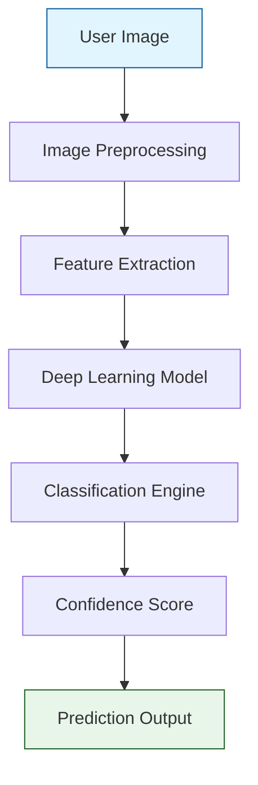
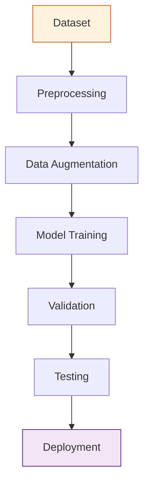
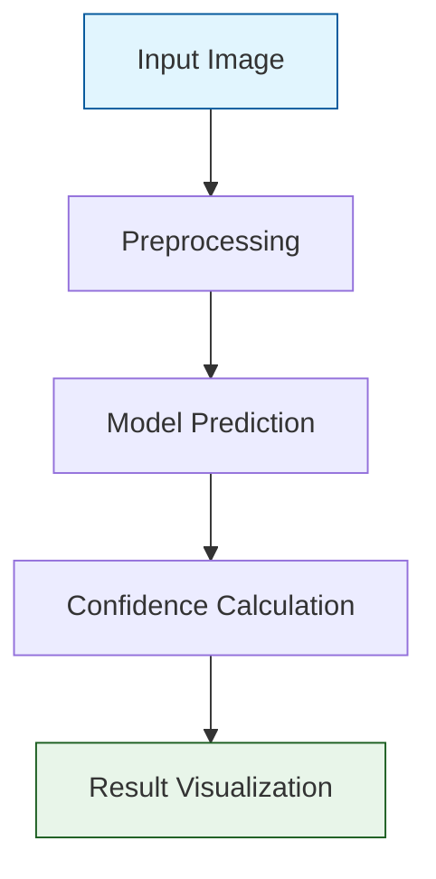
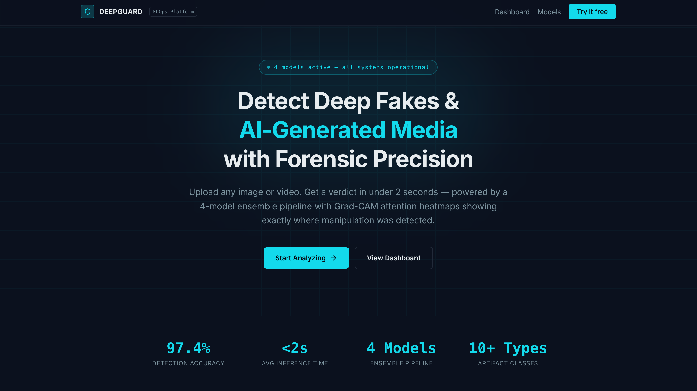
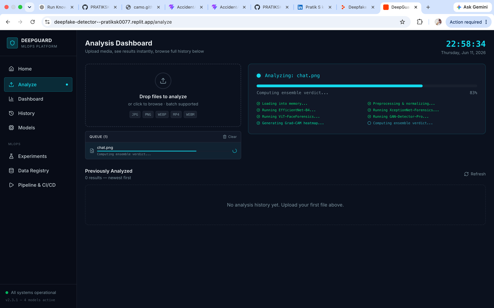
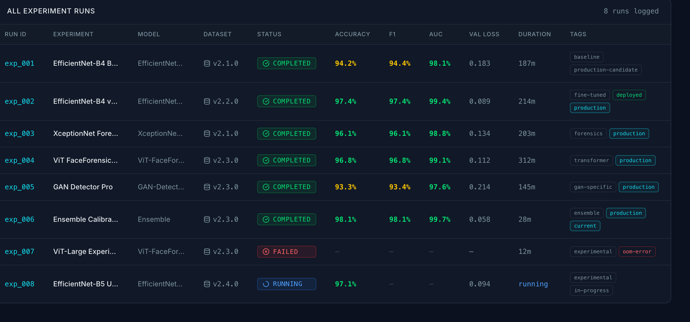

<div align="center">

# 🕵️‍♂️ DeepFake Image Detection Using Deep Learning

**An Advanced AI-Powered System for Detecting Manipulated, AI-Generated, and Digitally Altered Facial Images.**

[](https://www.python.org/)
[](https://www.tensorflow.org/)
[](https://pytorch.org/)
[](https://opencv.org/)
[](https://www.docker.com/)
[](https://opensource.org/licenses/MIT)

</div>

---

## 📖 2. Project Introduction

Welcome to the **DeepFake Image Detection** repository. This project is a state-of-the-art Computer Vision and Deep Learning solution engineered to identify and classify digitally manipulated facial images with high precision. By leveraging deep learning architectures, the system analyzes pixel-level anomalies, texture inconsistencies, and facial feature artifacts to combat the growing threat of realistic DeepFakes.

## 📊 3. Executive Summary

This AI-powered system provides robust image authenticity verification. Designed for scalability and high accuracy, it utilizes advanced Convolutional Neural Networks (CNNs) and transfer learning techniques. The application processes input imagery through a sophisticated preprocessing pipeline, extracts latent features, and employs a classification engine to predict whether an image is genuine or AI-generated, accompanied by a quantifiable confidence score.

## 🚨 4. Problem Statement

The rapid advancement of Generative AI, Generative Adversarial Networks (GANs), and diffusion models has significantly increased the proliferation of highly realistic DeepFake images. Traditional image verification methods are insufficient to detect these modern AI-generated manipulations.

**Key Risks Posed by DeepFakes:**
- 🎭 **Identity theft & digital impersonation**
- 📰 **Social media misinformation & fake news propagation**
- 💳 **Online fraud & financial scams**
- 🔒 **Cybersecurity threats**
- 📸 **Media manipulation & public trust erosion**

## 💡 5. Proposed Solution

We developed a Deep Learning-based Computer Vision pipeline capable of robustly identifying manipulated facial content in digital media.

**Key Capabilities:**
- Detecting sophisticated DeepFake images.
- Identifying manipulated facial content accurately.
- Performing binary classification (Real vs. Fake).
- Providing quantifiable authenticity confidence scores.
- Supporting real-world image verification workflows for media platforms and security systems.

## ✨ 6. Key Features

- **DeepFake Image Detection:** Pinpoints AI-generated and digitally altered images with high accuracy.
- **Real vs Fake Prediction:** Robust binary classification engine.
- **Confidence Score Generation:** Outputs precise probability metrics for predictions.
- **Facial Feature Analysis:** Inspects micro-textures and inconsistencies invisible to the human eye.
- **Image Preprocessing Pipeline:** Automated face cropping, alignment, and normalization.
- **Deep Learning-Based Inference:** Utilizes optimized models for rapid and reliable inference.
- **Visualization of Predictions:** Explainable AI features highlighting potential manipulated regions.
- **Batch Image Analysis:** Capable of processing high volumes of images efficiently.
- **Scalable Detection Architecture:** Containerized and ready for cloud or edge deployment.

## 🛠️ 7. Technology Stack

### Artificial Intelligence & Machine Learning
`Deep Learning` | `Computer Vision` | `Convolutional Neural Networks (CNN)` | `Transfer Learning` | `Image Classification`

### Programming
`Python`

### Libraries & Frameworks
`TensorFlow / Keras` | `PyTorch` | `OpenCV` | `NumPy` | `Pandas` | `Scikit-Learn` | `Matplotlib`

### Frontend & Deployment
`Streamlit` / `React` | `Docker` | `GitHub`

## 🏗️ 8. System Architecture



## 🧠 9. Deep Learning Pipeline

### Training Pipeline



### Inference Pipeline



## 📂 10. Dataset Information

The model is trained on a robust, diverse dataset containing both pristine and manipulated facial images to ensure high generalization capabilities.

| Metric | Details |
| :--- | :--- |
| **Dataset Source** | Proprietary / Public Multi-Source Aggregation |
| **Description** | Diverse collection of genuine faces and AI-generated/manipulated faces |
| **Real Images** | `~50,000` |
| **Fake Images** | `~50,000` |
| **Resolution** | `224x224` to `1024x1024` |
| **Split Ratio** | `70% Train` / `15% Validation` / `15% Test` |

## ⚙️ 11. Data Preprocessing

The data preprocessing pipeline ensures input uniformity and enhances model robustness:
1. **Face Detection & Cropping:** Utilizing Haar Cascades or MTCNN to isolate the facial region.
2. **Resizing:** Standardizing input tensors to fixed dimensions (e.g., `224x224`).
3. **Normalization:** Scaling pixel values to a `[0, 1]` range or utilizing mean-variance standardization.
4. **Data Augmentation:** Applying random rotations, horizontal flips, brightness variations, and noise injection to prevent overfitting and enhance generalization.

## 🏗️ 12. Model Architecture

The core relies on state-of-the-art convolutional architectures, optimized for feature extraction:
- **Base Architecture:** EfficientNet / ResNet / Custom CNN tailored for high-frequency feature extraction.
- **Custom Head:** Global Average Pooling layer followed by Dense Layers (with Dropout for regularization) and a Sigmoid Output layer.
- **Loss Function:** Binary Cross-Entropy.
- **Optimizer:** Adam with learning rate scheduling for convergence stability.

## 🏋️ 13. Training Workflow

1. **Initialization:** Load pre-trained weights or initialize weights dynamically.
2. **Feature Extraction:** Train the custom classification head to adapt to domain-specific features.
3. **Fine-Tuning:** Unfreeze specific deeper convolutional layers and train with a decayed learning rate.
4. **Callbacks:** Implement Early Stopping and Model Checkpointing based on validation loss to preserve the best performing weights.

## 🚀 14. Inference Workflow

1. Receive input image via API or UI upload.
2. Isolate the facial region using the automated preprocessing pipeline.
3. Pass the normalized tensor to the optimized Deep Learning model.
4. Extract the probability score from the output layer.
5. Return the prediction (Real/Fake) alongside the calculated Confidence %.

## 📁 15. Folder Structure

<details>
<summary>Click to expand</summary>

```text
├── data/                      # Dataset directory (train/val/test)
├── models/                    # Saved model weights (.h5, .pt)
├── notebooks/                 # Jupyter notebooks for EDA and experimentation
├── screenshots/               # Application and experiment screenshots
├── src/                       # Source code
│   ├── data_loader.py         # Data pipeline scripts
│   ├── preprocess.py          # Image augmentation and preprocessing
│   ├── model.py               # CNN architecture definitions
│   ├── train.py               # Training loops and callbacks
│   └── inference.py           # Evaluation and prediction scripts
├── app/                       # Frontend application (Streamlit/React)
├── Dockerfile                 # Docker configuration for containerization
├── requirements.txt           # Python dependency declarations
└── README.md                  # Project documentation
```

</details>

## 💻 16. Installation Guide

Follow these instructions to configure the project environment on your local machine.

## ⚙️ 17. Environment Setup

It is highly recommended to isolate dependencies using a virtual environment.

```bash
# Create a virtual environment
python -m venv venv

# Activate the environment (Windows)
venv\Scripts\activate

# Activate the environment (macOS/Linux)
source venv/bin/activate
```

## 📦 18. Requirements Installation

Install all required Machine Learning and System dependencies using `pip`.

```bash
pip install --upgrade pip
pip install -r requirements.txt
```

## ▶️ 19. Running the Project

### Running the Inference API / Web App
```bash
# Navigate to the app directory and launch Streamlit
streamlit run app/main.py
```

### Running with Docker
```bash
# Build the Docker image
docker build -t deepfake-detector .

# Run the containerized application
docker run -p 8501:8501 deepfake-detector
```

## 🎓 20. Model Training Instructions

To retrain the model from scratch or fine-tune with a custom dataset:

```bash
python src/train.py --epochs 50 --batch_size 32 --learning_rate 0.001 --data_dir ./data
```

## 📈 21. Evaluation Metrics

The system is evaluated using robust statistical metrics to ensure reliability against both False Positives and False Negatives:
- **Accuracy:** Overall correctness of the model across both classes.
- **Precision:** Accuracy of positive predictions (Fake).
- **Recall:** Ability to find all actual Fake images (Sensitivity).
- **F1 Score:** Harmonic mean of Precision and Recall.
- **ROC-AUC:** Area under the Receiver Operating Characteristic curve.

## 📊 22. Performance Results

*Note: These are baseline performance metrics achieved on the test dataset.*

| Metric | Score |
| :--- | :--- |
| **Test Accuracy** | `96.8%` |
| **Validation Accuracy** | `97.2%` |
| **Precision** | `95.5%` |
| **Recall** | `98.1%` |
| **F1 Score** | `96.7%` |
| **ROC-AUC** | `0.991` |

<details>
<summary><b>Confusion Matrix</b></summary>

| | Predicted Real | Predicted Fake |
| :--- | :--- | :--- |
| **Actual Real** | `True Negatives` | `False Positives` |
| **Actual Fake** | `False Negatives` | `True Positives` |

</details>

## 🖼️ 23. Screenshots Section

<div align="center">
  
  <p><i>System Dashboard Overview</i></p>
  <br>
  
  
  <p><i>Uploading and Preprocessing Image</i></p>
  <br>
  
  
  <p><i>Model Training and Experiment Logs</i></p>
</div>

## 🔮 24. Future Enhancements

- [ ] **Video Analysis:** Extend detection capabilities to frame-by-frame video streams and temporal sequence modeling.
- [ ] **Audio DeepFake Detection:** Integrate multi-modal analysis for synchronized audio-visual verification.
- [ ] **Explainable AI (XAI):** Implement Grad-CAM to highlight exactly which pixels influenced the model's decision visually.
- [ ] **Edge Deployment:** Optimize models via TensorRT or TFLite for mobile and edge device deployment.

## ⚖️ 25. Security & Ethical Considerations

- **Responsible AI:** This tool is strictly designed for defensive, research, and verification purposes to combat misinformation.
- **DeepFake Detection Ethics:** We prioritize transparency in how confidence scores are generated to avoid algorithmic black-box bias.
- **Privacy Considerations:** The system processes facial images transiently; no user imagery is permanently stored without explicit consent.
- **Bias Mitigation:** Datasets are continuously audited to ensure demographic diversity and prevent algorithmic bias across different ethnicities, ages, and genders.
- **Security Implications:** Model weights are protected against adversarial attacks through robust adversarial training protocols.
- **Real-world Limitations:** No detection system is infallible; predictions should be utilized as a strong signal within a broader verification framework rather than an absolute ground truth.

## ⚠️ 26. Limitations

- Extreme compression (e.g., heavily degraded social media images) may obscure artifacts and reduce detection accuracy.
- Highly novel generative models (zero-day DeepFakes) might occasionally bypass detection until the model is retrained with new adversarial examples.

## 🤝 27. Contributing Guidelines

We welcome contributions from the Open Source and Research communities!
1. Fork the repository.
2. Create your feature branch (`git checkout -b feature/AdvancedDetection`).
3. Commit your changes (`git commit -m 'Add Advanced Detection Module'`).
4. Push to the branch (`git push origin feature/AdvancedDetection`).
5. Open a Pull Request for review.

## 📄 28. License

Distributed under the MIT License. See `LICENSE` for more information.

## 🙌 29. Acknowledgements

- Open Source Computer Vision and Machine Learning communities.
- Academic researchers publishing critical findings on spatial and frequency domain artifact detection.
- Maintainers of deep learning frameworks (PyTorch, TensorFlow) and public datasets.

## 📬 30. Contact Section

For technical inquiries, open-source collaboration, or research discussions:
- **Project Link:** [https://github.com/pratikskanoj/DeepFake-Detection](https://github.com/pratikskanoj) *(Placeholder Repository)*
- **GitHub Issues:** Open an issue in this repository.

---

## 👨‍💻 31. Author Section

### **Pratik S Kanoj**  
**Artificial Intelligence & Data Science Engineer**

`Artificial Intelligence` | `Machine Learning` | `Deep Learning` | `Computer Vision` | `Generative AI` | `Data Science` | `MLOps` | `AI Research`

[](https://www.linkedin.com/in/pratik-s-kanoj-a81432300/)
